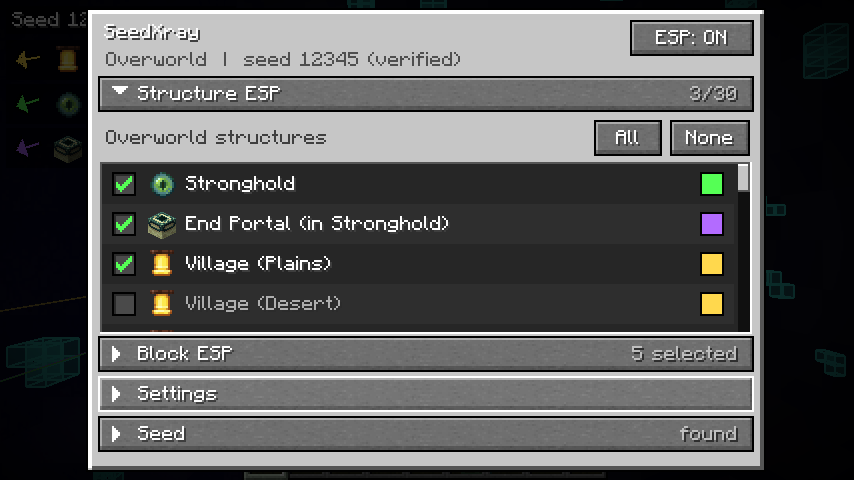
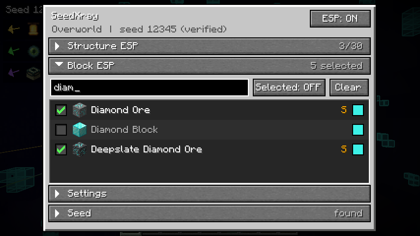
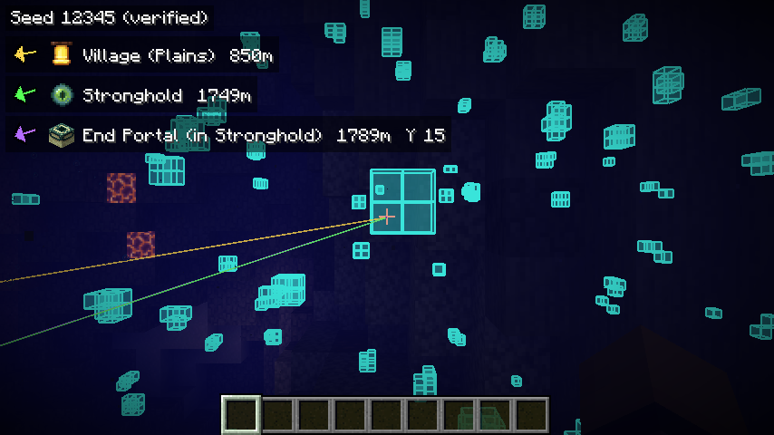
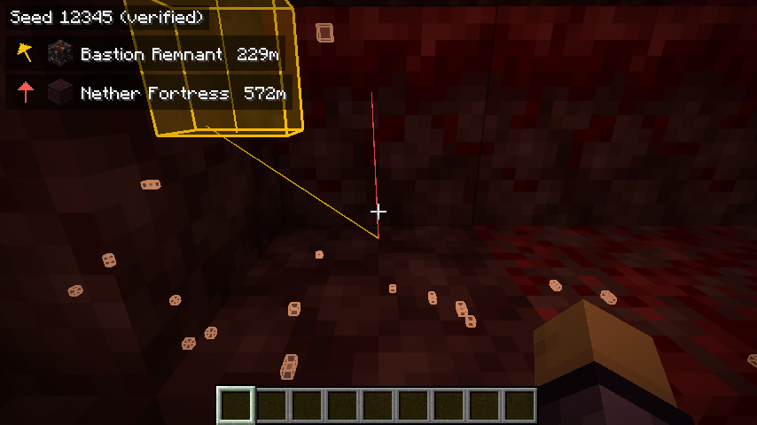

# SeedXray

Клиентский мод для **Minecraft 1.21.11 (Fabric)**: «сид-рентген». Находит сид мира, пишет его в локальный чат и
подсвечивает структуры и блоки (руды и любые другие) сквозь стены, считая их **из сида** — то есть там, где
сервер вам этого не показывает (anti-xray, нечитанные чанки, структуры за тысячи блоков).

Всё считается кодом самой игры (мод запускает ванильный генератор мира у вас на клиенте), поэтому результат
совпадает с реальным миром. Мод работает только на клиенте, на сервер ничего не отправляет.

## Что умеет

* **Seed Finder** — при входе пишет в чат `[SeedXray] Seed found: <число>` (число кликабельно: копируется).
  * одиночная игра / LAN: сид читается напрямую;
  * сервер: сервер отдаёт клиенту только *хеш* сида. Сначала мод быстро проверяет простые варианты (маленькие
    числа, слова, известные сиды), а если не нашёл — **вычисляет сид из увиденного**, как SeedcrackerX (см. ниже).
    Любой найденный сид **проверяется по хешу**, поэтому неверный сид не принимается.
    Если знаете сид — введите его один раз: `/seedxray seed <сид>` (он тоже сверяется с хешем и запоминается).
* **Меню** (Right Shift, меняется в настройках управления) в стиле Майнкрафта с раскрывающимися подменю:
  * **Structure ESP** — галочки по структурам *текущего измерения*;
  * **Block ESP** — список всех блоков игры с иконками, поиск, прокрутка, галочки;
  * **Settings** — стиль подсветки, радиусы, лимиты, режим для слабых ПК и т.д.;
  * **Seed** — статус сида, ручной ввод, повторный поиск.
* **Три измерения.** В Незере меню показывает только структуры Незера, в Энде — только структуры Энда,
  в Верхнем мире — Верхнего мира.
* **Элитра.** В Верхнем мире — стрелка и расстояние до крепости и **до портала в Энд** (точная комната с рамками),
  в Энде — **«End Ship (Elytra)»**: точная позиция рамки с элитрой на корабле (корабли есть не у всех городов —
  мод находит только те, где он реально есть).
* Подсветка: контур/заливка сквозь стены, лучи-трейсеры, вертикальный луч у структур, HUD со стрелкой, иконкой и
  расстоянием до ближайшей структуры каждого выбранного типа.
* Руды по сиду: уголь, железо, медь, золото, редстоун, лазурит, алмазы, изумруды, кварц, незеритовый лом
  (ancient debris), а также крупные жилы железа/меди, гравий, туф и т.д. Любой блок можно подсветить и в уже
  загруженных чанках (мод сканирует их сам).
* Названия структур и блоков всегда на английском.

## Как мод находит сид на сервере (как SeedcrackerX)

Сервер не говорит сид, но мод может вычислить его, пока вы играете. Идея и распознавание структур портированы из
[SeedcrackerX](https://github.com/19MisterX98/SeedcrackerX) (MIT, KaptainWutax / 19MisterX98), сам подбор написан
заново и использует правила размещения из игры:

1. Мод следит за загруженными чанками и узнаёт структуры: пустынный храм, храм в джунглях, хижина ведьмы, иглу,
   океанский монумент, клад (buried treasure), город Энда, и **10 обсидиановых столбов Энда**.
   Позиция каждой структуры в своём регионе зависит от сида, так что каждая даёт кусочек информации (в чат
   пишется `Spotted ... bits`).
2. Когда данных достаточно, в фоне ищется «structure seed» (48 бит):
   * **со столбами Энда** (достаточно ~30 бит структур, например 5–6 городов Энда или 4 храма): столбы дают 16 бит,
     остаётся 2^32 вариантов, около 10–40 с;
   * **без Энда**: нужно ~5 старых структур (храмы/иглу/хижины, 40+ бит), поиск «через младшие биты».
3. Недостающие 16 бит находятся перебором по хешу, который прислал сервер.

Текущий прогресс виден в меню (Seed) и в HUD (строка `Cracker: ...`), команда `/seedxray crack` печатает статус,
`/seedxray crack clear` сбрасывает собранное. Совпадение с настоящим сервером проверено: сид 12345 найден по пяти
иглу (≈35 с) и по столбам Энда + пяти городам Энда + иглу (≈15 с); позиции всех типов структур совпали с `/locate`.

## Скриншоты

| Структуры | Блоки |
| --- | --- |
|  |  |

| Алмазы по сиду сквозь землю + стрелки к структурам | Незер: бастион, крепость, ancient debris |
| --- | --- |
|  |  |

## Управление

| Что | Как |
| --- | --- |
| Меню | **Right Shift** (или `/seedxray`) |
| Вкл/выкл ESP | клавиша «Toggle SeedXray ESP» (по умолчанию не назначена) или кнопка в меню |
| Цвет | клик по цветному квадратику в списке (ПКМ — сбросить) |

Команды: `/seedxray` (`/sx`) · `/seedxray seed [сид]` · `/seedxray search` · `/seedxray where` (координаты ближайших
выбранных структур в чат) · `/seedxray toggle`.

## Сборка

Нужна Java 21.

```
./gradlew build          # jar: build/libs/seedxray-<версия>.jar
./gradlew test -Pslow    # плюс долгие тесты подбора сида (около минуты)
./gradlew runClient      # запуск клиента для разработки
./gradlew runClient -PquickPlay=localhost:25565   # сразу зайти на сервер
```

Положите jar в `mods/` вместе с **Fabric Loader ≥ 0.19** и **Fabric API** для 1.21.11.
Версии (Minecraft / Yarn / Loader / Fabric API) лежат в `gradle.properties`.

## Как это работает

Всё в `dev.seedxray.sim` — это «симулятор мира» поверх классов самой игры:

* `StructureLocator` — расстановка структур: spacing/separation/salt, concentric rings (крепости), исключающие
  зоны, взвешенные варианты, проверка биома и сборка частей структуры (как `hasChildren()` в ваниле).
* `TerrainCache` — ванильный рельеф чанка (noise, поверхностные правила, пещеры), без мира и сервера.
* `OreSimulator` — генерация руд: те же seed'ы декораций, порядок фич, модификаторы размещения и форма жил
  (`OreFeature`/`ScatteredOreFeature`), плюс жилы, которые создаёт сам noise-этап.
* Вычисления идут в одном фоновом потоке с низким приоритетом; игровой поток только рисует готовые списки.

Сверка с настоящим сервером 1.21.11 (сид 12345): все найденные структуры (деревни, древние города, бастионы,
крепости, города Энда, испытательные камеры и т.д.) совпали с `/locate`; позиции рамок с элитрой и комнаты портала —
с реальными блоками; руды в Верхнем мире совпали на 93–100 %, в Незере (ancient debris) — на 100 %.

## Ограничения

* Сид сервера нельзя «прочитать»: его надо вычислить (нужно походить и увидеть структуры, см. выше) или ввести.
  Серверы, которые подменяют хеш сида, не дадут проверить результат (тогда `/seedxray seed <сид> force`).
  Список известных сидов можно пополнить в `config/seedxray_seeds.txt`.
* Предсказание руд не знает про изменения, сделанные игроками, и про структуры, вырезающие блоки (шахты и т.п.);
  в загруженных чанках пещеры/лава отсеиваются по реальным блокам.
* Только ванильная генерация (стандартные пресеты Верхнего мира/Незера/Энда). Моды и датапаки, меняющие
  генерацию, не учитываются.
* Используйте на серверах, где это разрешено правилами.

## Для слабых компьютеров

В `Settings` есть **Low-end mode** (меньше радиусы и лимит блоков, только контуры, без трейсеров). Вычисления в
фоне, меню без размытия, рисуются только видимые строки списков, вся подсветка — два буфера на кадр.
